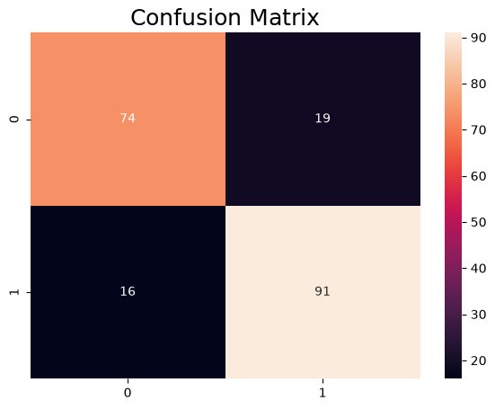
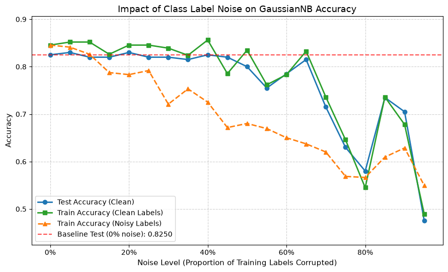
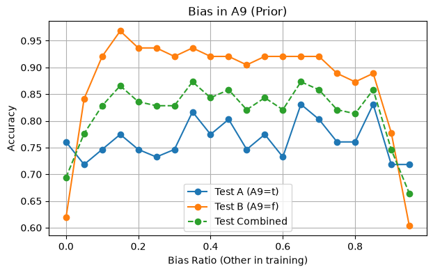
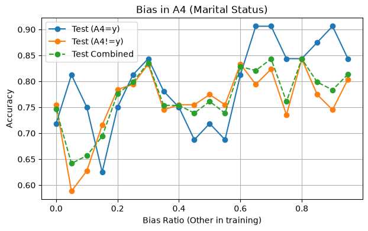
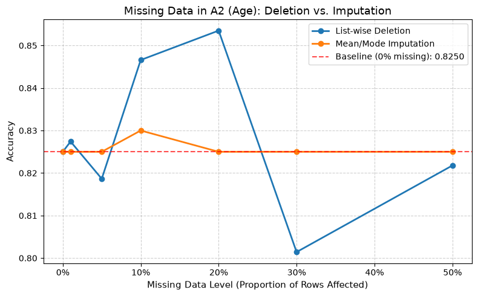
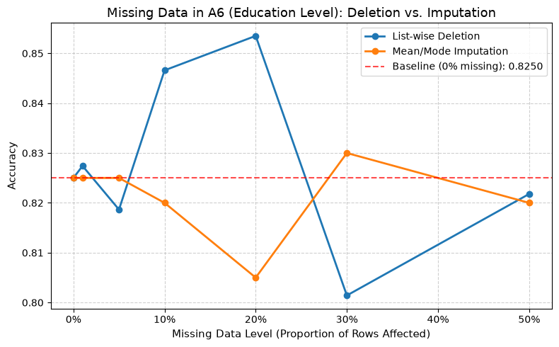
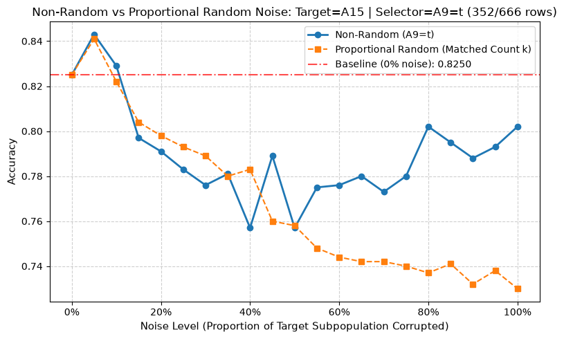
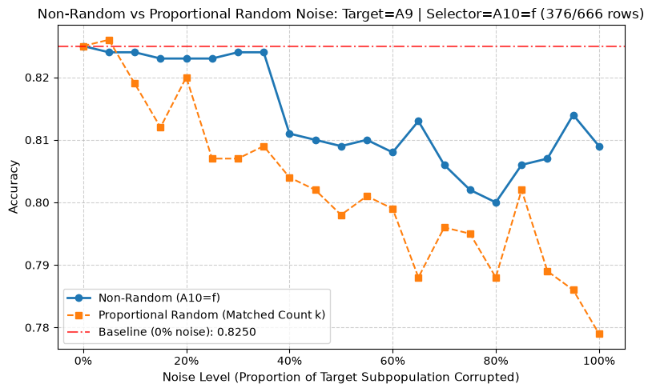

# Lab 1 DS & AI — Data Quality: Exercise Reflection

**Group 19** — Ariful Islam Riane (3981886), Pedro Fernandez Tonso (3983781)

All exercises use the same UCI **credit-a** (credit approval) dataset: 666 rows after
dropping nulls, nominal features one-hot encoded, `class` (`+`/`-`) as target, a
`GaussianNB` classifier with a fixed 70/30 train/test split (`random_state=100`).
Baseline test accuracy is **~0.825**.

---

## Exercise 1 — Random Noise in Input Features

### Methodology
For a chosen feature we progressively replace a fraction of its values with noise drawn
from an independent uniform distribution (uniform over `[min, max]` for numerical
features, uniform over the observed categories for categorical ones). Noise levels run
from 0% to 95% in 5% steps (`replace_by_noise` / `build_data`). At each level we
re-encode, retrain `GaussianNB`, and record test accuracy against the clean baseline.
The single-feature experiment was then repeated for **every** feature to rank how much
the model depends on each.

*(The per-feature accuracy plots are generated in the notebook but were not saved into
the committed outputs.)*

### Takeaways
- We started with `A1` (gender) and saw **no degradation** from corrupting it. Sweeping
  all features showed the model depends on only a **small number** of them.
- `A9` (prior default) and `A15` (income) are the only features whose corruption causes
  real performance loss. `A1`, `A12`, `A14` show essentially zero degradation even at
  high noise — the model barely uses them.
- Because the dataset already contains a prior-decision signal (`A9`), the classifier is
  effectively doing a Bayesian update; destroying the prior hurts most because the other
  features do not carry enough information to recover the correct label on their own.

---

## Exercise 2 — Random Noise in Class Labels

### Methodology
Everything upstream (encoding, split, baseline model) is kept fixed. We corrupt **only
`y_train`**: `add_label_noise` selects a fraction of training labels and reassigns each
to a value drawn *uniformly* from the class set (`+`/`-`) — not a deliberate flip.
`X_train`, `X_test` and `y_test` stay untouched, so every run is evaluated on the same
clean benchmark. Noise levels 0%–95% in 5% steps. We track test accuracy, train accuracy
vs. clean labels, and train accuracy vs. the noisy labels.

### Baseline


### Result


### Takeaways
- Test accuracy stays at baseline (0.80–0.83) for **all nominal noise levels up to 50%**,
  then degrades.
- **Why:** uniform reassignment means a "noisy" binary label has a 50% chance of landing
  back on its correct value. The effective corruption rate is
  `noise_level × (k−1)/k = noise_level × 0.5`, so nominal 50% noise only really corrupts
  ~25% of labels — GaussianNB's per-class mean/variance estimates stay close to the truth.
- Past 50% nominal noise the effective flip rate approaches 50% (pure coin flip, zero
  label signal). Accuracy does not decline smoothly there — it becomes **unstable**
  (0.72 → 0.63 → 0.58 → 0.74), because which samples happen to keep vs. flip their label
  swings the fitted boundary.
- At the extreme (nominal ~0.95, effective ~0.475) accuracy falls to ~0.475, matching the
  test-set majority-class base rate (~53.5% `-`).
- **Lesson:** "% noise injected" overstates "% labels effectively corrupted" whenever the
  injection can reassign a sample its own label — for binary labels the effective rate is
  half. Always report the effective flip rate, accounting for class count and balance.

---

## Exercise 3 — Bias in the Data

### Methodology
Pick one feature and split rows into group **A** (`feature == basis_val`) and group
**B** (everything else). Build a fixed, balanced test benchmark: 20% of A and 20% of B,
held out and never changed. The training set is fixed in size at `n = |Train_A|`.
Starting from a fully A-biased training set, we increase a ratio `r` and replace `r·n`
of the A rows with B rows (sampled with replacement). At each ratio we retrain and
evaluate separately on `Test_A`, `Test_B` and `Test_Combined`. Ratios 0%–95% in 5% steps.

### A9 (prior default, binary) — strongly predictive


`A9` is highly informative: `A9=t` → 79.6% approved, `A9=f` → 94% rejected.

### A4 (marital status, multi-category) — weakly predictive


### Takeaways
- At ratio 0.00 the model trains only on group A and is badly skewed — for `A9` it
  overpredicts the approved class and does poorly on `Test_B` (0.62).
- Adding group-B rows quickly lifts `Test_B` accuracy (up to ~0.97 around 15%) and
  overall combined accuracy — a **better class/group mix produces better overall
  performance**.
- When training becomes extremely skewed the *other* way (ratio > 0.9, almost all `A9=f`),
  accuracy on both groups collapses again (combined ~0.66).
- For the weakly-predictive `A4` the same manipulation moves accuracy far less and more
  noisily — bias in an uninformative attribute matters much less than bias in a
  predictive one.

---

## Exercise 6 — Missing Data

### Methodology
Corrupt one attribute at a time across the **whole** dataset (set a fraction of its
values to `NaN`), *then* split into train/test, so both parts contain missing values.
Missing levels: 0%, 1%, 5%, 10%, 20%, 30%, 50%. Two cleaning strategies are compared:
- **List-wise deletion** — drop any row (train *or* test) with a missing value in the
  target column. This shrinks the evaluation set as the missing level rises.
- **Mean/mode imputation** — fill with the mean (numerical) or mode (categorical)
  computed from the **training rows only**, applied to both train and test.

The 0% level reproduces the clean baseline (0.8250) for both curves.

### A2 (age, numerical) — mean imputation


```
Missing 0.00 | Deletion: 0.8250 | Imputation: 0.8250
Missing 0.10 | Deletion: 0.8466 | Imputation: 0.8300
Missing 0.20 | Deletion: 0.8535 | Imputation: 0.8250
Missing 0.50 | Deletion: 0.8218 | Imputation: 0.8250
```

### A6 (education level, categorical) — mode imputation


### Takeaways
- **Imputation stays flat** across all missing levels (0.805–0.830): filling with the
  mean/mode barely changes what the model sees.
- **Deletion is noisier** (0.80–0.85). Each missing level is scored on a *different,
  smaller* test set, so results are sensitive to which rows are dropped.
- Deletion occasionally scores *above* baseline (e.g. 0.8535 at 20% missing on A2). This
  is **not a real improvement** — with only ~157 of 200 test rows left, ~4–5 rows swing
  accuracy ~3 points. Across 30 random seeds, deletion at 20% missing averages 0.828
  (± 0.017), i.e. right on baseline; the notebook's single seed just landed high.
- Neither `A2` nor `A6` is strongly tied to the label, so accuracy stays near the 0.825
  baseline even at 50% missing regardless of strategy.
- **Lesson:** to compare missing-data strategies fairly, keep the test set fixed/complete
  and only clean the training side, or average each point over many seeds with error bars.

---

## Exercise 9 — Non-Random Noise in Input Features

### Methodology
"Non-random" noise restricts corruption to a **subgroup** defined by a selector
attribute, leaving the complementary subgroup untouched. `inject_noise` corrupts a
fraction of the target column *only* for rows where `selector_col == selector_val`
(uniform-over-range for numerical, uniform-over-categories for categorical). Each
non-random run is compared against a **proportional random** run that corrupts the *same
absolute number of rows* `k`, but drawn from the whole dataset. Noise levels 0%–100% in
5% steps, averaged over 5 seeds.

### Numerical target: A15 (income), corrupting only `A9='t'`


Target group = 352/666 rows (52.9%).

### Categorical target: A9 (prior default), corrupting only `A10='f'`


Target group = 376/666 rows (56.5%).

### Takeaways
- Non-random corruption often stays **more resilient** than count-matched random
  corruption, especially at high noise. For `A15` the non-random curve recovers to
  ~0.80 at 80–100% noise while the proportional-random curve keeps sinking to ~0.73.
- The reason: concentrating damage in one subpopulation leaves a **clean decision
  boundary intact for the untouched subgroup**, so the model still classifies that
  half well. Spreading the same amount of noise across everyone degrades the boundary
  for all rows.
- The effect is milder for the categorical target `A9` corrupted within `A10='f'`
  (non-random ~0.81 vs random ~0.78 at full noise) but points the same direction.
- **Lesson:** where the corruption falls matters as much as how much there is. Aggregate
  "% corrupted" hides that structured/targeted errors and uniform errors have different
  consequences — targeted errors can even look benign in aggregate accuracy while
  systematically failing one subgroup.
