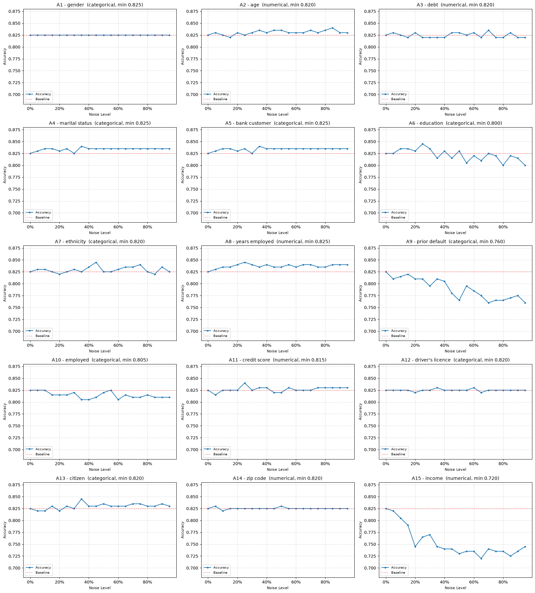

# Lab 1 DS & AI: Data Quality Exercise Reflection

**Group 19** | Ariful Islam Riane (3981886), Pedro Fernandez Tonso (3983781)

All experiments use the same UCI credit-approval dataset (666 rows after dropping nulls),
nominal features one-hot encoded, with a Gaussian Naive Bayes classifier and a fixed 70/30
split. The clean baseline test accuracy is **0.825**. Each experiment injects one
data-quality problem at growing severity and watches how accuracy responds.

---

## Exercise 1: Random noise in an input feature

**What we did.** Replace a growing fraction of one feature's values with random noise, repeated for every feature. We expected the accuracy cost to be spread across many features.

**What we noticed.**
- 13 of the 15 features can be almost fully randomised with no measurable effect.
- Only income (A15) and prior default (A9) move the model, down to about 0.72 and 0.76;
  income already starts hurting at about 15% noise.

**Takeaway.** Almost all the predictive power sits in two features, income and prior default, roughly what a real credit decision depends on. Corrupting any of the other 13 does nothing, the model was barely using them. Income degrades earlier and further than prior default probably because it is numeric: randomising it blurs the gap between approved and rejected, while prior default is only a yes/no flag.

---

## Exercise 2: Random noise in the class labels

**What we did.** Corrupt a growing fraction of the training labels by reassigning each to a random class, keeping the test set clean. Since the classes are roughly balanced, only about half of those reassignments actually flip a label, so "50% noise" means closer to 25% wrong labels. We expected accuracy to fall steadily.

**What we noticed.**
- Test accuracy holds near the 0.825 baseline up to about 50% noise, then drops toward
  chance.
- Meanwhile the model fits fewer and fewer of the noisy training labels, but that does not   show up on the test set until the noise is severe.

**Takeaway.** Generalisation is surprisingly robust to messy labels. As long as most training labels are still right the model mostly learns the right thing; the wrong ones add confusion but do not move the decision much. Accuracy only collapses once wrong labels approach half, when the classes become impossible to tell apart and the model falls back to guessing the majority.

---

## Exercise 3: Bias in the training data

**What we did.** Split the data by prior default (group A = A9=t, group B = A9=f) and slide the training set from all group A to almost all group B, testing on a fixed balanced set. We expected the model to track whichever group dominates training.

**What we noticed.**
- With a mix of both groups in training (roughly 10% to 85% B), combined accuracy is high
  and flat (about 0.82 to 0.87), and group B is always easier than group A.
- Both extremes break down: training on a single group drops combined accuracy to about
  0.66.
- Repeating this with marital status (A4), a weak predictor, barely changes anything.

**Takeaway.** A reasonably mixed training set is safe: the model only needs a modest slice
of each group to learn both, and bias only bites at the extremes. The surprise was the far
end. We expected "trained mostly on B, so it fails on A", but training on a single group is
what breaks it: with almost no approved examples left, the model's sense of what "approved"
looks like gets unreliable and it over-predicts that class on both groups. And this only
happened because A9 is a feature the model leans on; doing the same to a weak predictor
like A4 changed almost nothing.

---

## Exercise 6: Missing values in a feature

**What we did.** Blank a growing fraction of the two features that matter (income and prior default) in the training set only, then compare two fixes: drop the affected rows, or fill them with the training mean/mode. The test set stays clean and fixed. We expected both fixes to lose accuracy, with imputation worse because it distorts the feature.

**What we noticed.**
- Imputation stays flat near the 0.825 baseline the whole way, even at 90% missing.
- Deletion holds until about 30% missing, then falls off a cliff, down to 0.56 at 90% when
  almost no training rows are left.
- The deletion curve is identical whichever feature we blank; only imputation depends on
  which one.

**Takeaway.** Here the limiting factor turned out to be training-set size, not feature quality. Deletion only cares how many rows survive, so it breaks once too few are left. Imputation keeps every row and fills the gap with a constant, which the model simply learns to ignore, so accuracy barely moves. This is the flip side of Exercise 1: a random value in a feature misleads the model, but a constant one is harmless. So deletion is only safe when
missing values are rare.

---

## Exercise 9: Noise concentrated in one subgroup

**What we did.** Corrupt income only for applicants with a prior default (A9=t), and compare against corrupting the same number of rows picked at random. We expected the targeted
version to be worse, since it wipes out income information for that whole subgroup.

**What we noticed.**
- The opposite happened: targeted noise degrades less, and at full noise it partly recovers
  (about 0.80) while random noise keeps sinking (about 0.73).
- The spared subgroup (A9=f) is unaffected either way; the whole gap is inside the
  corrupted subgroup.
- Corrupting income in the training set only, not the test set, is much worse than
  corrupting both.

**Takeaway.** What matters is whether the corruption is consistent between training and test. When every A9=t row has its income destroyed, the model learns income is useless there and leans on the other features instead (mainly A9=t itself, which already points to "approved"). Random noise hits only about half the subgroup, so the model keeps half-trusting income and gets misled on the test rows where it is fake. A feature that is reliably broken is safer than one that is unpredictably broken. The same setup on prior
default pointed the same way, more weakly.
